<h1>RAPHAËL COURSIER</h1>

<strong>Développeur web &amp; logiciel junior</strong> · BTS SIO, option SLAM

  Je transforme des besoins concrets en interfaces claires et en applications métier maintenables, 
  du cadrage à la livraison.

  
  
  

<picture>
  <source
    media="(prefers-color-scheme: dark)"
    srcset="https://readme-typing-svg.demolab.com?font=Fira+Code&amp;weight=600&amp;size=20&amp;duration=2600&amp;pause=900&amp;color=CCFF00&amp;center=true&amp;vCenter=true&amp;repeat=true&amp;width=780&amp;height=45&amp;lines=Architecture+claire+%C2%B7+code+maintenable;Backend+%C2%B7+mobile+%C2%B7+data+%C2%B7+UI%2FUX;Concevoir+%C2%B7+structurer+%C2%B7+tester+%C2%B7+livrer"
  >
  <source
    media="(prefers-color-scheme: light)"
    srcset="https://readme-typing-svg.demolab.com?font=Fira+Code&amp;weight=600&amp;size=20&amp;duration=2600&amp;pause=900&amp;color=087C6C&amp;center=true&amp;vCenter=true&amp;repeat=true&amp;width=780&amp;height=45&amp;lines=Architecture+claire+%C2%B7+code+maintenable;Backend+%C2%B7+mobile+%C2%B7+data+%C2%B7+UI%2FUX;Concevoir+%C2%B7+structurer+%C2%B7+tester+%C2%B7+livrer"
  >
  
</picture>

<code>craft_over_template = true;</code>

---

## 💡 À propos

> Actuellement en **BTS SIO option SLAM** au lycée Guy Mollet d'Arras, promotion 2027, je développe mes compétences en web, mobile et logiciel avec l'objectif de poursuivre vers l'ingénierie logicielle.
>
> **Mon profil ?** Déterminé et curieux. Je ne me contente pas de suivre les cours : j'explore chaque jour de nouvelles technologies et j'affine ma logique pour résoudre des problèmes concrets.
>
> **Mon ambition ?** Devenir un développeur complet pour, à terme, **créer ma propre entreprise** de solutions logicielles.
>
> 

---

## 🧰 Stack et outils

  

- **Web &amp; mobile** — HTML, CSS, JavaScript, responsive, animations, Twig, Stimulus, Flutter et Dart.
- **Backend &amp; données** — PHP, Symfony, API REST, JWT, Doctrine, MySQL, modélisation et migrations.
- **Qualité &amp; livraison** — Git, Docker, Bash, PHPUnit, sécurité par rôles, documentation et RGPD.
- **Design &amp; création** — Figma, UI/UX et direction visuelle ; Canva, Premiere Pro et Audition en complément.
- **3D &amp; interaction** — Vite, Three.js, WebGL, STLLoader, MediaPipe, Canvas et Web Audio.

---

# 🏗 Mes projets

## 💼 Projets clients

* Projets conçus à partir d'un besoin client réel.

| Projet | Description |
|---|---|
| **Wheello · Habitat Insertion** | Application métier de gestion de flotte réalisée pendant mon stage : back-office Symfony, API REST sécurisée par JWT et application mobile Flutter. **Livré en 2026 · code client privé.** |
| **Site Jessica Dew** | Site vitrine sur mesure pour une photographe : direction artistique, galerie responsive et parcours de contact. **En cours d'itération avec la cliente.** |

---

## 🎓 Projets académiques

* Projets réalisés dans le cadre de mon BTS SIO ou de travaux académiques.

| Projet | Description |
|---|---|
| [StreamCorner](https://github.com/rfielbal/StreamCorner) | Boutique e-commerce Symfony 6.4 : catalogue, panier, favoris, commandes, comptes clients et back-office. **En ligne ·** [voir la démo](https://stream-corner.rfielbal.fr). |
| [Le Secret du Conservateur](https://github.com/rfielbal/Escape-Game) | Escape game culturel jouable dans le navigateur, développé en JavaScript et Canvas avec collisions, audio, énigmes et contrôles clavier/tactile. |
| [Chicken Louisiane Steakhouse](https://github.com/rfielbal/AP-Chicken-Louisiane) | Premier site web réalisé pendant le BTS pour découvrir l'intégration HTML/CSS et les bases du responsive. **En ligne ·** [voir la démo](https://4719.s3.nuage-peda.fr/Chicken%20Louisiane/index.html). |

---

## 💻 Projets personnels

* Projets développés pour expérimenter de nouveaux usages, interfaces et mécaniques.

| Projet | Description |
|---|---|
| [AetherCore](https://github.com/rfielbal/AetherCore) | Visualiseur STL 3D avec Three.js et WebGL : import de modèles, mesures et contrôle gestuel optionnel via MediaPipe. **Prototype jouable.** |

---

## 📊 GitHub Stats

  
  

---

  

